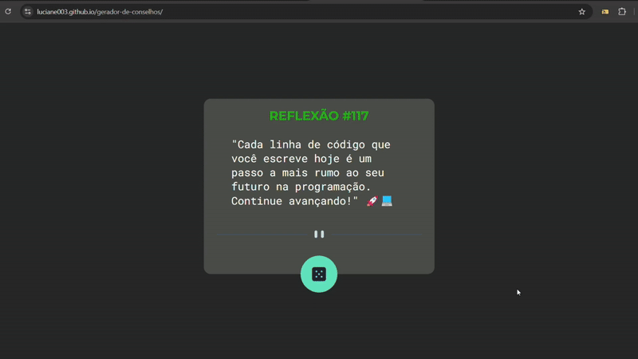

# Gerador de Conselhos 💫

## Sobre o projeto

Ele é um projeto visual um Gerador de Conselhos,possui responsividade, no momento o botão é apenas uma simulação de funcionalidade ao clicar nenhuma nova frase é gerada, pois as funcionalidades interativas ainda não foram implementadas. Isso ocorre porque, até o estágio atual do meu curso, ainda não aprendi JavaScript 
Funcionalidades dinâmicas serão adicionadas futuramente, conforme eu evoluir nos estudos.

## Desafios

Esse foi o meu primeiro projeto feito totalmente sozinha. No início, achei um pouco desafiador, mas com a prática constante tudo foi se tornando mais claro e natural. A cada passo, fui ganhando mais confiança e o desenvolvimento ficou cada vez mais tranquilo.

## Projeto no ar
Acesse a versão online do [projeto](https://luciane003.github.io/gerador-de-conselhos/)

## Funcionalidades
- Layout responsivo
- Futuramente irá gerar vários conselhos
- Botão que brilha ao ser clicado

## Tecnologias usadas

  
  

 

## Como visualizar o projeto localmente
### Clonar o repositório
git clone https://github.com/luciane003/gerador-de-conselhos.git
### Abra o arquivo index.html no navegador

## Visualização

## Autora 
-  Luciane Kellen
- Feito como parte do meu processo de aprendizagem.

  
  
  

