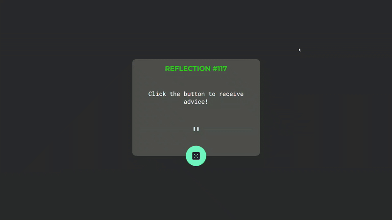

# Gerador de Conselhos💫

## Sobre o projeto

Este é um projeto visual de um Gerador de Conselhos (Advice Generator), desenvolvido com HTML, CSS e agora com JavaScript.

A interface é responsiva e permite, ao clicar no botão, buscar conselhos aleatórios por meio de uma API externa

## Desafios

Foi desafiador quando adicionei JavaScript, pois estou começando a praticar essa linguagem agora e tudo ainda é muito novo para mim. A parte mais complexa foi criar a função que integra a API de conselhos aleatórios. No entanto, no final tudo deu certo, porque não desisto facilmente. Gosto de desafios e aprender algo novo me motiva cada vez mais.

## Projeto no ar
Acesse a versão online do [projeto](https://luciane003.github.io/gerador-de-conselhos/)

## Funcionalidades
- Layout responsivo
- Estilo moderno com foco em acessibilidade visual
- Integração com API para geração de conselhos aleatórios
- Botão que brilha ao ser clicado

## Tecnologias usadas

  
  
  

 

## Como visualizar o projeto localmente
### Clonar o repositório
git clone https://github.com/luciane003/gerador-de-conselhos.git
### Abra o arquivo index.html no navegador

## Visualização

## Autora 
-  Luciane Kellen
- Feito como parte do meu processo de aprendizagem.

  
  
  

